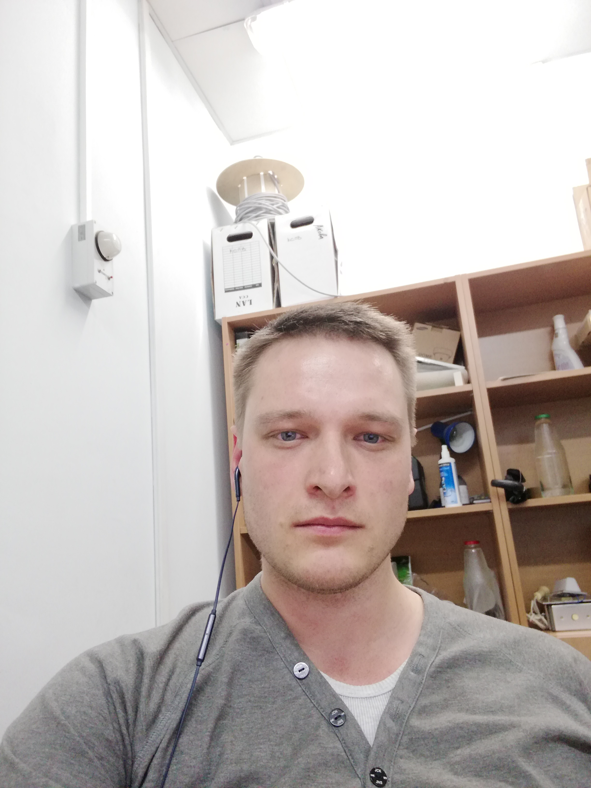

### Ihar Mahonaw
---


---
## Junior Frontend Developer
---
# Contact information:
---


# Phone: +7 555 127765357
# E-mail: Trulala@gmail.com
# Telegramm: @Litrgramm


---
## Actualy About Myself:
---


At the moment I am studying at rs-school with the aim of obtaining a profession developer. Among my interests in the field of development, the following can be highlighted: layout, development of web projects, programming large data processing services, solving interesting problems and simply gaining practice in the real work of a programmer.


---
## Skills and Proficiency:
---


* HTML5, CSS;
* JS;
* Python;
* Git, Github;
* VS code;

---
## Code example
---
*This code bubble sorts an array in ascending order.*

```def bubble_sort(arr):
    n = len_arr(arr)
    for i in range(n):
  if arr[j] > arr[j+1]:
                arr[j], arr[j+1] = arr[j+1], arr[j]
                swapped = True
        `if not swapped:
            `break`
    return arr
def len_arr(arr):
    count = 0
    for _ in arr:
      count += 1
    return count
```
---
## Courses:
---

RS-school

---
## Languages
---
* Russian - native
* English - intermideate
* Belarussian - native
* Franch - elementary

it is just to begining...